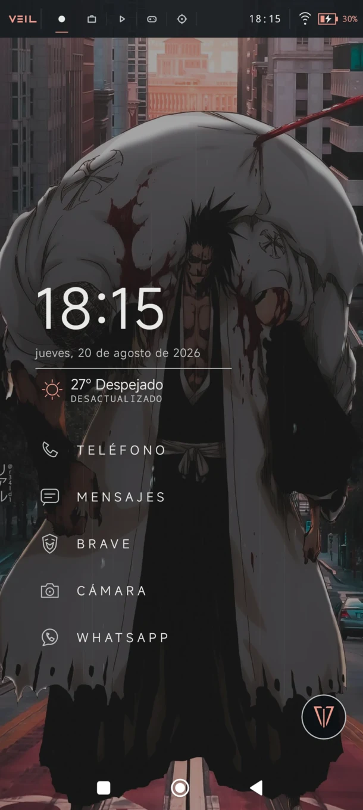
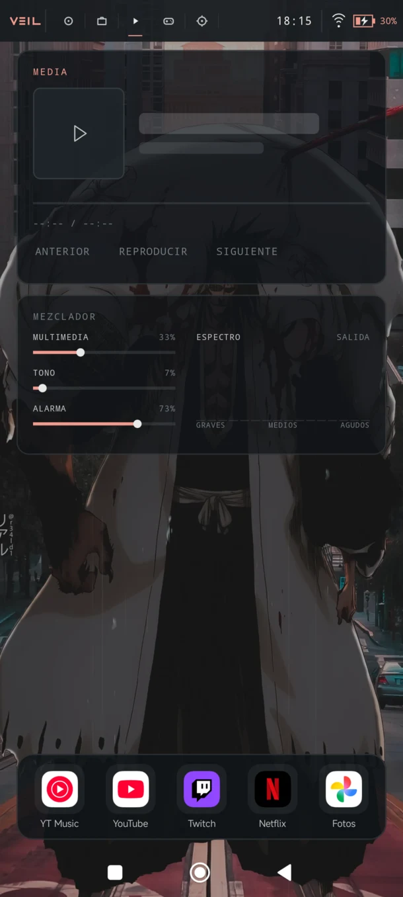
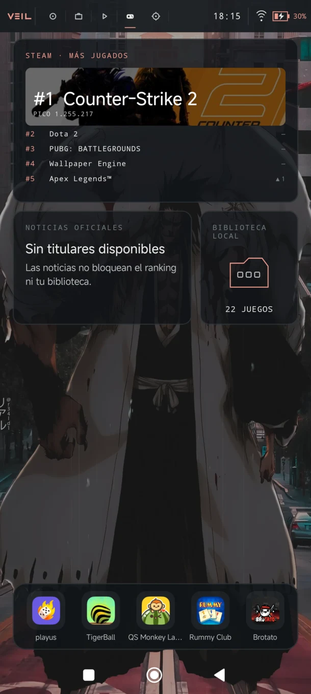
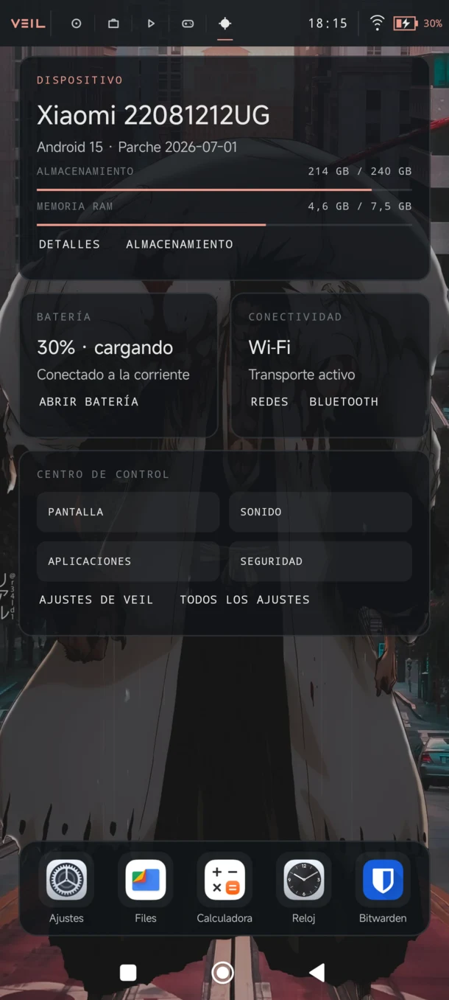
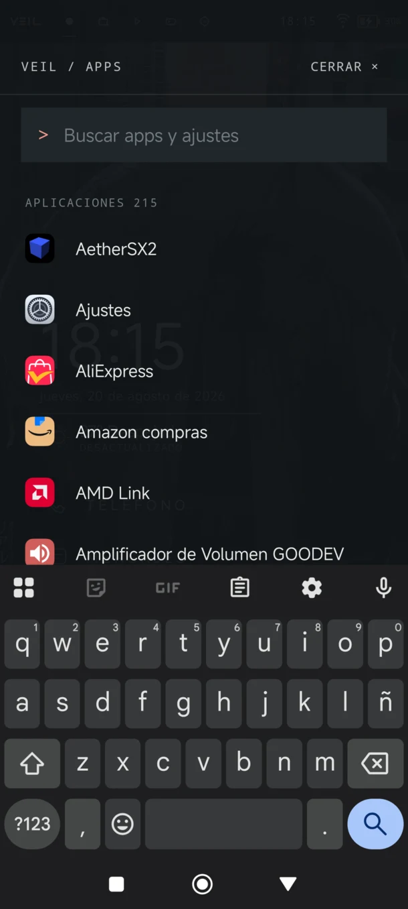

<div align="center">
  <h1>Veil</h1>
  <p><strong>Un launcher Android tranquilo, contextual y construido alrededor de tu fondo de pantalla.</strong></p>
  <p><sub>Android 6.0+ · Kotlin · Jetpack Compose · v0.1.0</sub></p>
</div>

> La filosofía de Qtile llevada a una interfaz táctil, no una copia del escritorio.

Veil convierte la pantalla de inicio en una capa discreta del sistema. En lugar de llenarla con widgets, prioriza la **continuidad ambiental**: recuerda actividades públicas que Android ya expone —como reproducción multimedia, navegación o progreso— y facilita retomarlas.

Inicio permanece limpio. A su alrededor, el usuario elige cuatro espacios de trabajo con una jerarquía visual clara, datos reales y accesos rápidos estables.

## Capturas

<p align="center">
  <a href="docs/screenshots/home.webp"></a>
  <a href="docs/screenshots/media.webp"></a>
  <a href="docs/screenshots/games.webp"></a>
  <a href="docs/screenshots/device.webp"></a>
  <a href="docs/screenshots/everything.webp"></a>
</p>

<p align="center"><sub>Inicio · Media · Juegos · Dispositivo · Everything</sub></p>

## Qué hace diferente a Veil

- **Continuidad ambiental:** Inicio destaca la actividad pública más relevante que Android permite reanudar, sin leer conversaciones ni inferir actividad privada.
- **Espacios de trabajo editoriales:** cada vista tiene una finalidad concreta y una composición diseñada, no una cuadrícula genérica de widgets.
- **El fondo sigue siendo protagonista:** superficies oscuras y translúcidas conservan la presencia del wallpaper y mantienen el contenido legible.
- **Dock contextual:** cada espacio dispone de cinco aplicaciones configurables que permanecen en posiciones estables.
- **Everything:** un cajón alfabético con búsqueda local, acciones de aplicación y accesos directos a ajustes del sistema.
- **Datos honestos:** si falta un permiso, proveedor o dato, la geometría se mantiene y Veil muestra un estado vacío claro en lugar de inventar información.

## Espacios de trabajo

**Inicio** es fijo. El usuario selecciona y ordena otras cuatro vistas desde el catálogo integrado:

| Vista | Función principal |
| --- | --- |
| **Inicio** | Hora, tiempo, accesos esenciales y la actividad más relevante para continuar. |
| **Planificación** | Agenda, notas rápidas locales y temporizador Pomodoro. |
| **Concentración** | Sesiones de Focus, próximo evento y las mismas notas rápidas. |
| **Media** | Sesión multimedia activa, controles compatibles, salida y contexto de colección. |
| **Juegos** | Ranking público de Steam, noticias oficiales y biblioteca local de juegos Android. |
| **Dispositivo** | Estado del sistema, batería, conectividad y accesos directos a ajustes. |
| **En movimiento** | Navegación pública compatible, tiempo y próximo evento. |

Las vistas se publican como parte de la aplicación: no hay plugins ejecutables, layouts descargados ni un editor de geometría. El proceso interno para añadir una composición está documentado en [Añadir un espacio de trabajo](docs/ADDING_WORKSPACE.md).

## Interacción

- Desliza horizontalmente para cambiar entre Inicio y los cuatro espacios activos.
- Desliza hacia arriba para abrir **Everything**.
- Pulsa Home con Veil abierto para alternar entre Everything e Inicio.
- Mantén pulsada una aplicación para abrirla, consultar su información o solicitar su desinstalación.
- Mantén pulsado un icono del dock para sustituirlo o eliminarlo; toca un hueco vacío para elegir una aplicación.
- Personaliza pantallas, color de acento, legibilidad, wallpaper, accesos y acciones de Inicio desde **Ajustes de Veil**.

## Instalación

Veil requiere **Android 6.0 (API 23) o posterior**. Al ser un launcher, Android pedirá confirmar qué aplicación debe gestionar la pantalla de inicio.

### Desde un APK

1. Descarga el APK desde [GitHub Releases](https://github.com/VicentUCF/Veil/releases) cuando haya una compilación publicada.
2. Abre el archivo en el dispositivo y permite temporalmente la instalación desde esa fuente si Android lo solicita.
3. Inicia Veil y pulsa **Launcher predeterminado** en sus ajustes, o ve a **Ajustes de Android → Aplicaciones predeterminadas → Aplicación de inicio**.
4. Elige Veil y completa la selección inicial de pantallas.

Los permisos de calendario, ubicación aproximada, notificaciones, alarmas y visualización de audio son opcionales y se solicitan únicamente cuando una función los necesita.

### Desde el código fuente

Necesitas JDK 17, Android SDK Platform 37 y `adb`. Activa la depuración USB, conecta el dispositivo y comprueba que aparezca como autorizado:

```bash
adb devices
```

Después compila e instala la variante de depuración:

```bash
git clone https://github.com/VicentUCF/Veil.git
cd Veil
./gradlew assembleDebug
adb install -r app/build/outputs/apk/debug/app-debug.apk
```

En Windows utiliza `gradlew.bat assembleDebug`. La opción `-r` conserva la configuración existente cuando actualizas una instalación firmada con la misma clave de depuración.

## Privacidad

Veil no incorpora cuentas, publicidad, analítica ni backend propio. Las aplicaciones instaladas, preferencias, notas, búsquedas y datos de calendario se procesan localmente.

Las únicas conexiones de producto son las necesarias para consultar el tiempo en Open-Meteo mediante ubicación aproximada y el contenido público de Steam mientras Juegos está visible. El acceso opcional a notificaciones mantiene señales restringidas en memoria y excluye llamadas, mensajes, correo, alarmas y contenido social.

Consulta la [política de privacidad](docs/PRIVACY_POLICY.md) y la [declaración de seguridad de datos](docs/DATA_SAFETY.md) para conocer el detalle.

## Tecnología y estado del proyecto

- Aplicación Android nativa con Kotlin, AndroidX, Jetpack Compose, Coroutines y StateFlow.
- Un único módulo `app`, sin framework de inyección de dependencias ni base de datos.
- Integración HOME real, diseño edge-to-edge y orientación vertical como prioridad.
- `minSdk 23`, `targetSdk 37` y namespace `dev.vicent.veil`.
- Versión actual: **v0.1.0**.

Para verificar el proyecto:

```bash
./gradlew test assembleDebug
```

La dirección del producto, el alcance de v0.1 y sus límites están definidos en [PROJECT_CONTEXT.md](docs/PROJECT_CONTEXT.md).

## Publicación de producción

Las builds `release` están cerradas por defecto. El proceso falla si no encuentra una firma de publicación, una política de privacidad HTTPS accesible y un correo de contacto válido.

```text
VEIL_UPLOAD_STORE_FILE=/ruta/absoluta/upload.jks
VEIL_UPLOAD_STORE_PASSWORD=...
VEIL_UPLOAD_KEY_ALIAS=...
VEIL_UPLOAD_KEY_PASSWORD=...
VEIL_PRIVACY_POLICY_URL=https://…
VEIL_PRIVACY_CONTACT=...
```

Configura estos valores únicamente en el almacén de secretos del entorno de publicación y ejecuta:

```bash
./gradlew clean test lint bundleRelease
```

